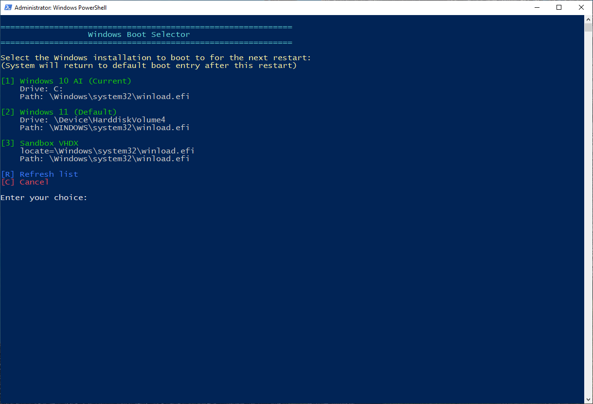

# Boot Destination Selector

A PowerShell utility that allows you to precisely control which Windows installation your system reboots into—just once—without permanently changing your boot configuration.

> Boot exactly where you need to go—just once.

## Features

- **Targeted Reboots**: Select exactly which Windows installation to boot into for the next restart only
- **Automatic Detection**: Automatically discovers all available Windows installations on your system
- **BitLocker Support**: Optional BitLocker suspension for one restart cycle
- **Self-Elevation**: Automatically requests admin privileges if needed
- **Clean Interface**: User-friendly console interface with clear options
- **Error Handling**: Robust error handling with helpful messages
- **Original Boot Order**: Returns to your default boot configuration after restart
- **Zero Configuration**: No setup required—just run the script

## Description

Boot Destination Selector solves a common problem for multi-boot Windows environments: temporarily booting to a specific Windows installation without changing your default boot configuration.

Perfect for:
- System administrators managing multi-boot environments
- Developers working across different Windows versions
- IT professionals performing maintenance on specific OS installations
- Power users who dual/multi-boot different Windows versions

## Usage

1. Run `BootDestinationSelector.ps1` (right-click → Run with PowerShell)
2. Select your desired boot destination from the list
3. Choose whether to suspend BitLocker (if applicable)
4. Confirm restart
5. Your system will reboot to the selected OS once, then return to your default boot configuration for subsequent restarts

## Screenshots




*(Replace with actual screenshots)*

## Requirements

- Windows 10/11
- PowerShell 5.1 or newer
- Administrator privileges (script will auto-elevate)

## Installation

No installation required. Simply download `BootDestinationSelector.ps1` and run it with PowerShell.

```powershell
# Run from PowerShell with administrator privileges
.\BootDestinationSelector.ps1
```

## How It Works

The script uses the Windows Boot Configuration Data (BCD) store to:
1. Identify all available Windows installations
2. Allow one-time selection of boot target using bcdedit /bootsequence
3. Optionally suspend BitLocker for one restart
4. Initiate system restart when confirmed

After reboot, your system automatically returns to the default boot configuration.

## License

MIT License - Feel free to use, modify, and distribute as needed.

---

## Changelog

- **v1.0.0** - Initial release
- **v1.1.0** - Added BitLocker support
- **v1.2.0** - Added auto-elevation feature
